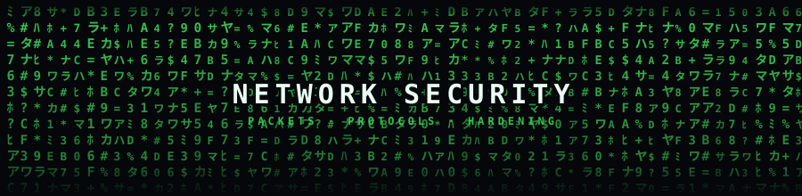
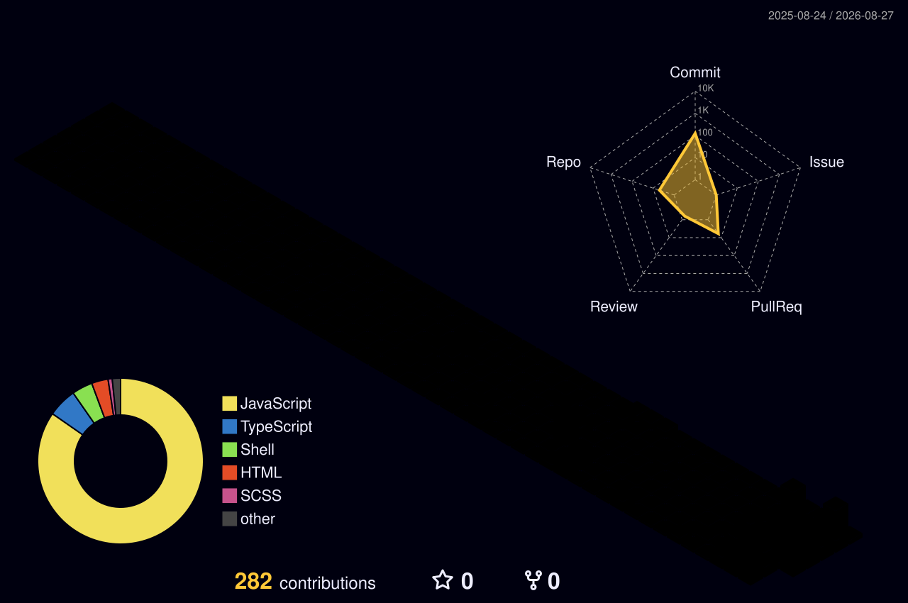

<!-- ═══════════════════════════ MATRIX BANNER ═══════════════════════════ -->
<p align="center">
  
</p>

<h1 align="center">Nadif Reza Fahlevi</h1>
<h3 align="center">Full-Stack Developer &nbsp;·&nbsp; Network Security Enthusiast &nbsp;·&nbsp; Indie Product Builder</h3>

<p align="center">
  <a href="https://github.com/adifreza">
    
  </a>
</p>

<p align="center">
  
  <a href="https://github.com/adifreza?tab=followers"></a>
  <a href="https://wdgames.store"></a>
  
</p>

<!-- ═══════════════════════════ ABOUT ═══════════════════════════ -->
### `whoami`

```yaml
name:      Nadif Reza Fahlevi  (@adifreza)
location:  Indonesia 🇮🇩
role:      Full-Stack Developer  +  Network Security Enthusiast
building:  WD Games — a digital-goods commerce platform (Laravel · Alpine · Tailwind)
mindset:  "I care as much about what's listening on port 443 as what renders in the browser"
loves:     clean architecture, packet analysis, breaking things ethically, then fixing them
motto:     ship fast, lock it down, keep it boring in production
```

I move comfortably across the whole stack **and** down the wire — from writing Laravel
controllers and React front-ends to reading packet captures, tuning firewall rules,
writing hardening checklists, and thinking like an attacker so the defender wins.

<!-- ═══════════════════════════ FOCUS ═══════════════════════════ -->
### Focus Areas

<table>
<tr>
<td width="50%" valign="top">

**🧩 Product Engineering**
- Full-stack web apps — Laravel 13, PHP, MySQL
- TypeScript · React 19 · Tailwind · Vite
- Desktop apps with Tauri v2 + Rust
- E-commerce, checkout flows, payment integration
- Clean, testable, maintainable architecture

</td>
<td width="50%" valign="top">

**🛡️ Security &amp; Networking**
- Network recon &amp; enumeration — Nmap, masscan
- Traffic analysis — Wireshark, tcpdump
- Web app testing — Burp Suite, OWASP ZAP, Nikto
- Hardening — firewalls, fail2ban, TLS, headers, least privilege
- Blue-team basics — IDS/IPS, log analysis, incident triage

</td>
</tr>
</table>

<!-- ═══════════════════════════ TERMINAL ═══════════════════════════ -->
<p align="center">
  
</p>

<!-- ═══════════════════════════ ARSENAL ═══════════════════════════ -->
### Tech Arsenal

**Languages &amp; Frameworks**

<p>
  
</p>

**Systems, Infra &amp; Shell**

<p>
  
</p>

**Security &amp; Networking Toolkit**

<p>
  
  
  
  
  
  
  
  
  
  
  
  
</p>

<!-- ═══════════════════════════ STATS ═══════════════════════════ -->
### GitHub Stats

<p align="center">
  
</p>

<p align="center">
  
  
</p>

<p align="center">
  
  
</p>

<!-- ═══════════════════════════ 3D CONTRIB ═══════════════════════════ -->
<p align="center">
  
</p>

<!-- ═══════════════════════════ CONNECT ═══════════════════════════ -->
### Connect

<p align="center">
  <a href="https://wdgames.store"></a>
  <a href="mailto:nadifakiyama@gmail.com"></a>
</p>


